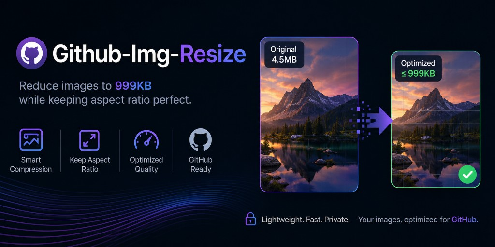
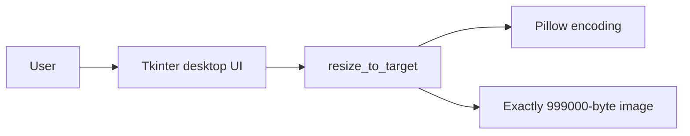

<p align="center">
  
</p>

# gh-img-resize

**gh-img-resize** is a desktop tool for GitHub users that turns an image into a file of **exactly 999 KB** (999,000 bytes) while keeping the original format and aspect ratio.

[](https://github.com/Crome696/gh-img-resize/actions/workflows/build.yml)
[](https://github.com/Crome696/gh-img-resize/actions/workflows/quality.yml)
[](https://github.com/Crome696/gh-img-resize/actions/workflows/security.yml)

## Project snapshot

- **Type:** Tkinter desktop app with a local image encoder
- **CI runtime:** Python 3.12
- **Libraries:** Pillow, PyInstaller
- **Input:** JPEG, PNG, GIF, WebP
- **Output:** exactly 999,000 bytes
- **Native builds:** Windows EXE, macOS `.app`, Linux binary (built on the target OS)
- **UI language:** German desktop UI; this README is English

## What it does

GitHub asks for PNG, JPG, or GIF files **under 1 MB** and treats 1 MB as **1,000,000 bytes**. Using 999 KiB (`999 × 1024 = 1,022,976` bytes) exceeds that cap and is rejected. This tool therefore uses decimal kilobytes: `999 × 1000 = 999,000` bytes.

Typical use is GitHub uploads such as repository social previews. The saved file is always exactly 999,000 bytes.

## Key features

- Fits JPEG, PNG, GIF, and WebP to exactly 999,000 bytes
- Keeps the original file format and aspect ratio
- Pads files that are already under 999 KB with format-native metadata instead of reducing quality
- For larger JPEG/WebP files, searches the highest quality that still fits, then reduces pixel size with LANCZOS if needed
- For PNG and GIF, only reduces pixel size (lossless formats)
- Applies EXIF orientation before re-encoding
- Runs locally; the application source has no network calls
- Ships as a native PyInstaller binary (no Electron wrapper, no cross-compile)

## Architecture

The desktop UI calls one encoder that either pads the original bytes or re-encodes and then pads to the exact target length.



### How sizing works

- Files already under 999 KB are padded with format-native metadata (JPEG COM, PNG `tEXt`, GIF comment, WebP `META` chunk). Quality is not reduced.
- Larger JPEG/WebP files first search the highest quality that fits, then reduce pixel dimensions with LANCZOS if needed.
- PNG and GIF only reduce pixel dimensions (lossless formats). Aspect ratio is preserved.
- EXIF orientation is applied before re-encoding.
- Animated GIFs are saved as a still image of the first frame.

## Project structure

- `run.py` — desktop entry point used by source runs and PyInstaller
- `src/gh_img_resize/app.py` — Tkinter UI
- `src/gh_img_resize/resizer.py` — exact-size encode and pad logic
- `tests/test_resizer.py` — size and aspect-ratio tests
- `gh-img-resize.spec`, `build.ps1`, `build.sh` — native builds
- `pyproject.toml`, `requirements-dev.txt` — Ruff and pip-audit tooling
- `.github/workflows/build.yml` — test and artifact workflow
- `.github/workflows/quality.yml` — Ruff and pip-audit
- `.github/workflows/security.yml` — Gitleaks and Trivy

## Getting started

### Desktop app from CI

1. Download the matching GitHub Actions artifact (`gh-img-resize.exe`, `gh-img-resize.app.zip`, or `gh-img-resize`).
2. Start the app.
3. Choose an image (JPEG, PNG, GIF, or WebP).
4. Save the result. The suggested name is `{original}-999kb.{ext}`.

Unsigned Windows and macOS builds may show SmartScreen or Gatekeeper warnings.

### Run from source

Windows:

```powershell
python -m venv .venv
.\.venv\Scripts\python.exe -m pip install -r requirements.txt
$env:PYTHONPATH = "src"
.\.venv\Scripts\python.exe run.py
```

macOS and Linux (install Tk on Ubuntu first: `sudo apt-get install -y python3-tk tcl-dev tk-dev`):

```bash
python3 -m venv .venv
.venv/bin/python -m pip install -r requirements.txt
PYTHONPATH=src .venv/bin/python run.py
```

## Usage and examples

1. Choose an image in the desktop UI.
2. Review the preview, format, pixel size, and current byte size.
3. Save as 999 KB. The encoder writes exactly 999,000 bytes and keeps the original extension.

If the source was already smaller than 999 KB, the UI reports that the file was padded rather than re-encoded. If pixel size had to change, the UI reports that the resolution was reduced with the same aspect ratio.

## Development and testing

Windows:

```powershell
$env:PYTHONPATH = "src"
.\.venv\Scripts\python.exe -m unittest discover -s tests -v
```

macOS and Linux:

```bash
PYTHONPATH=src .venv/bin/python -m unittest discover -s tests -v
```

Install development tools with `pip install -r requirements-dev.txt` (after the runtime requirements above).

Windows:

```powershell
.\.venv\Scripts\python.exe -m ruff check src tests run.py
.\.venv\Scripts\python.exe -m ruff format --check src tests run.py
.\.venv\Scripts\python.exe -m ruff format src tests run.py
.\.venv\Scripts\python.exe -m pip_audit -r requirements.txt
```

macOS and Linux:

```bash
.venv/bin/python -m ruff check src tests run.py
.venv/bin/python -m ruff format --check src tests run.py
.venv/bin/python -m ruff format src tests run.py
.venv/bin/python -m pip_audit -r requirements.txt
```

GitHub Actions workflows `.github/workflows/quality.yml` and `.github/workflows/security.yml` run these gates on pull requests. Quality runs Ruff and `pip-audit`. Security runs Gitleaks and Trivy.

PyInstaller reads the committed [gh-img-resize.spec](gh-img-resize.spec). Run the build **on the OS you want to ship**; Windows cannot produce a macOS app or Linux binary.

Windows:

```powershell
.\build.ps1
```

Writes `dist\gh-img-resize.exe`.

macOS and Linux:

```bash
bash build.sh
```

Writes `dist/gh-img-resize.app` on macOS and `dist/gh-img-resize` on Linux.

GitHub Actions workflow `.github/workflows/build.yml` runs tests and native builds on `windows-latest`, `macos-latest`, and `ubuntu-latest`, then uploads those three artifacts.

## Security, data, and limitations

- Image processing is local. The application source does not perform network requests.
- Output files may contain padding metadata (JPEG comment, PNG `tEXt`, GIF comment, or WebP `META`) so the byte length is exact.
- Animated GIFs become a still image of the first frame.
- There is no codesigning in the spec; unsigned Windows and macOS builds may be blocked by SmartScreen or Gatekeeper until the user allows them.
- This repository does not currently include a LICENSE file.
